

  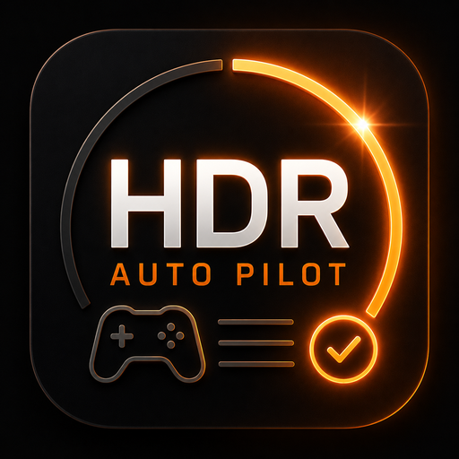

<h1 align="center">HDR Auto Pilot</h1>

  <strong>Automatic HDR detection and switching for Steam Game Mode.</strong>

  Library status badges ·
  <a href="https://www.pcgamingwiki.com/">PCGamingWiki</a> +
  <a href="https://store.steampowered.com/curator/33286359/">Steam HDR Curator</a> ·
  Automatic HDR switching · State restore · Per-game overrides

---

## About

**HDR Auto Pilot** is a Decky Loader plugin that integrates HDR compatibility information and automatic HDR switching directly into the Steam Game Mode library.

It detects HDR support for Steam games, displays HDR status directly in the library and on game detail pages, automatically configures HDR before launch, and can restore the previous HDR state after the game exits.

For installed games, a per-game **Override** can reverse the automatic launch decision.

  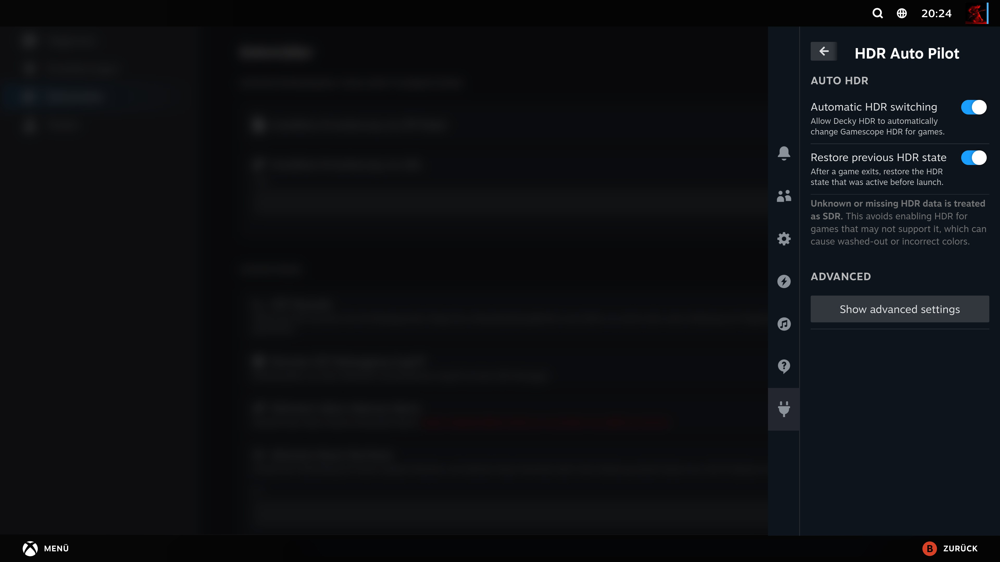

---

## Features

- Automatic HDR switching before game launch
- HDR status badges on Steam game detail pages
- Compact HDR status badges directly on Steam library capsules
- HDR information for installed and non-installed Steam games
- Full-library background HDR compatibility preload
- PCGamingWiki as the primary HDR data source
- Steam HDR Curator as an additional compatibility source
- Per-game **Override** for installed titles
- Automatic restoration of the previous HDR state after game exit
- Persistent local compatibility cache
- Manual HDR data refresh
- No live network requests on the launch-critical path
- Controller-friendly Steam Game Mode integration

---

## HDR status

| Status | Meaning | Auto Pilot default |
| --- | --- | --- |
| **HDR** | Native HDR support detected | HDR ON |
| **No HDR** | No native HDR support detected | HDR OFF |
| **Workaround** | HDR is available through a known workaround | HDR OFF |
| **No data** | No reliable HDR information is available | HDR OFF |

Unknown compatibility is handled conservatively as SDR.

### Library mini badges

HDR Auto Pilot displays the detected HDR state directly on Steam library capsules for both installed and non-installed games.

  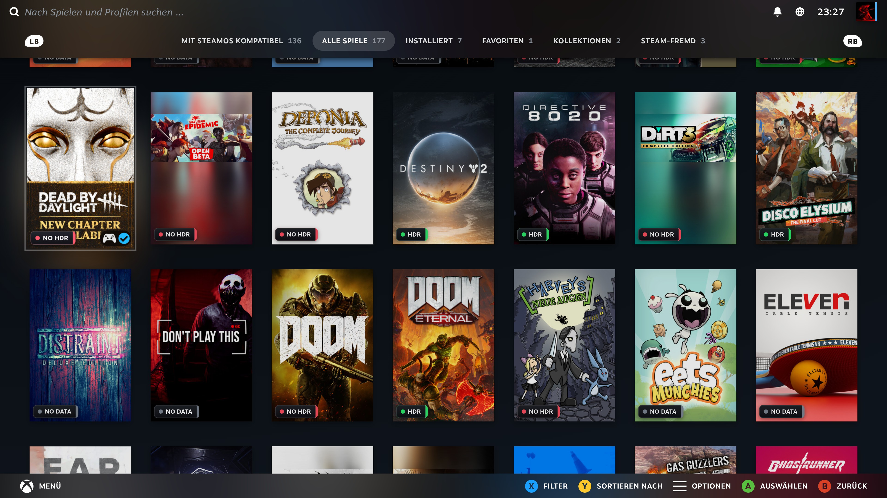

### Game detail badges

HDR Auto Pilot also displays a larger HDR status badge on Steam game detail pages.

For **installed games**, the badge is shown together with the per-game **Override** control:

<table>
<tr>
<td width="50%"><strong>HDR</strong> 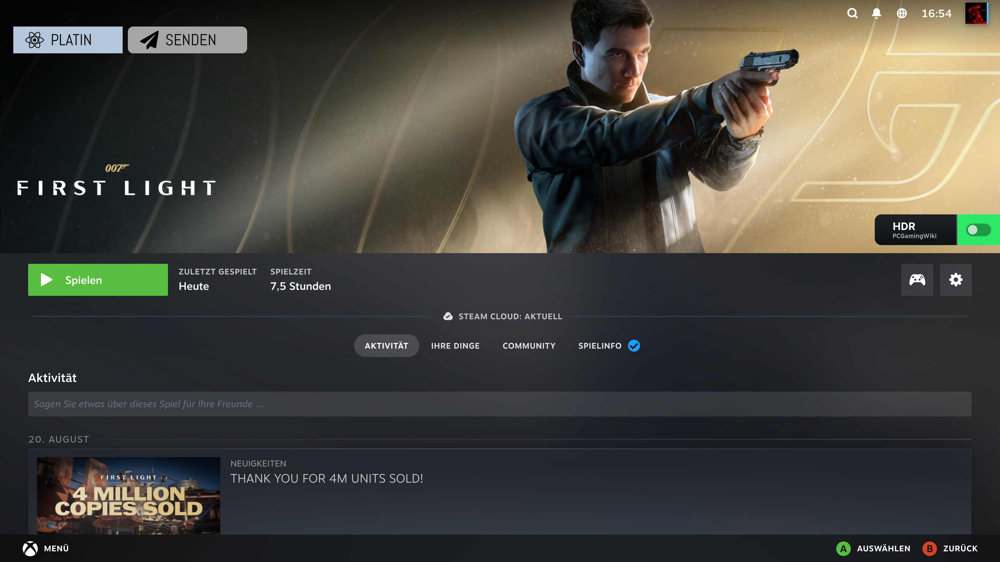</td>
<td width="50%"><strong>No HDR</strong> 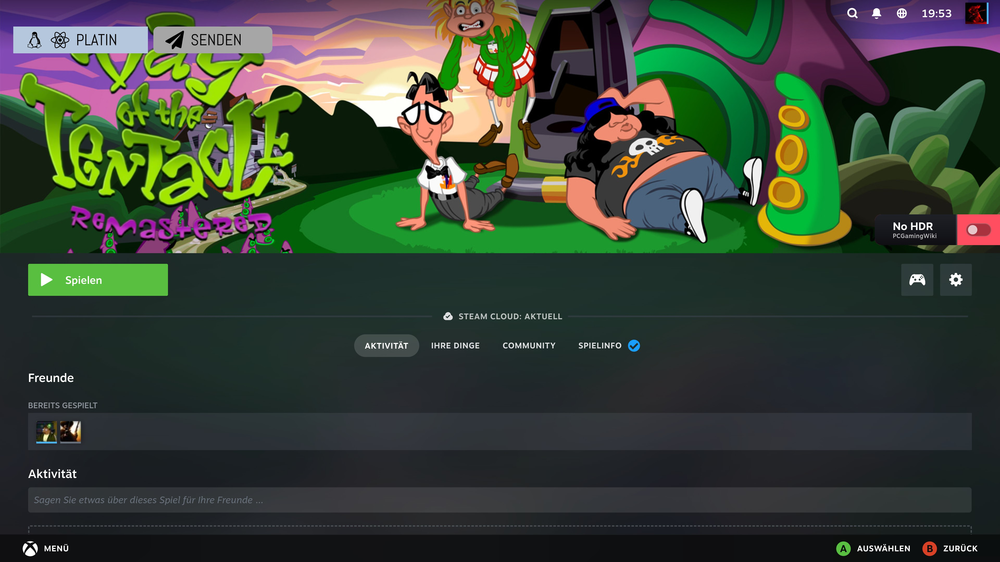</td>
</tr>
<tr>
<td width="50%"><strong>Workaround</strong> 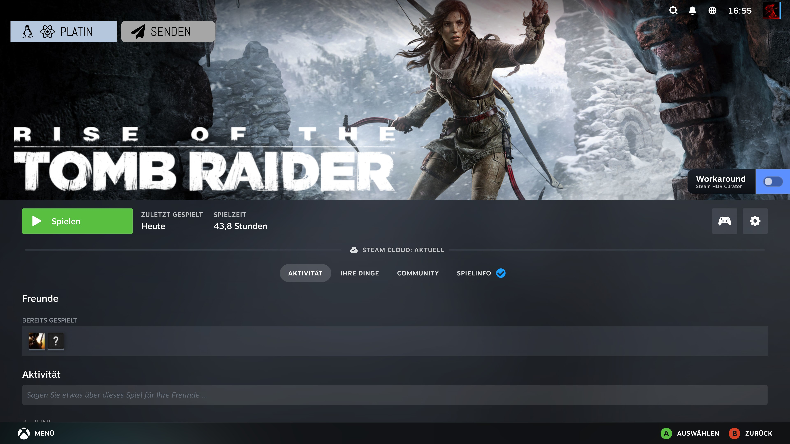</td>
<td width="50%"><strong>No data</strong> 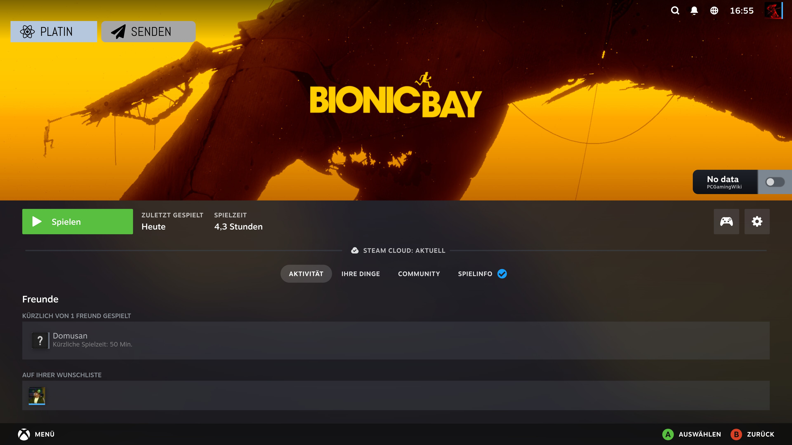</td>
</tr>
</table>

For **non-installed games**, the same HDR states are shown without the Override control:

<table>
<tr>
<td width="50%"><strong>HDR</strong> 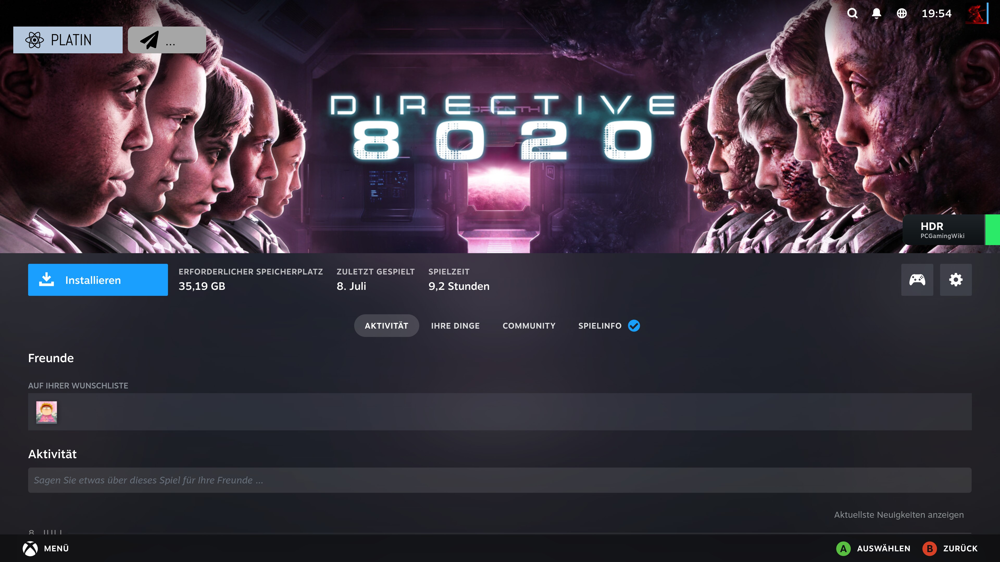</td>
<td width="50%"><strong>No HDR</strong> 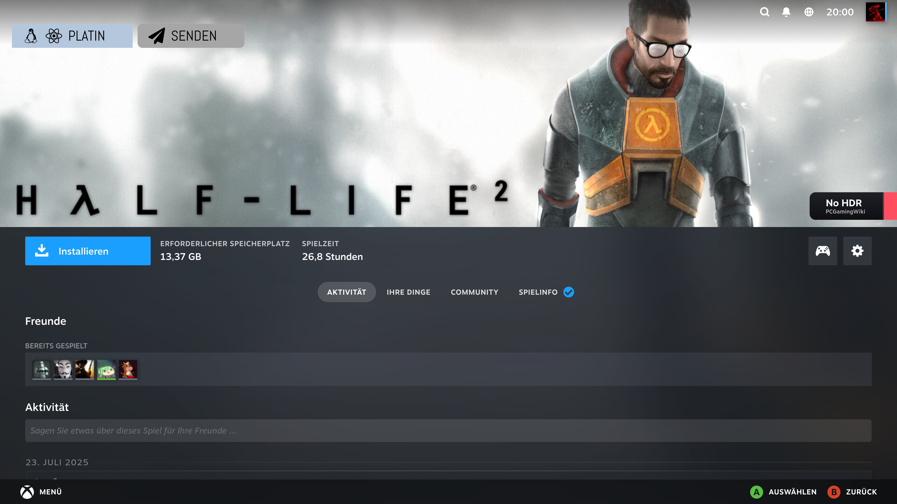</td>
</tr>
<tr>
<td width="50%"><strong>Workaround</strong> 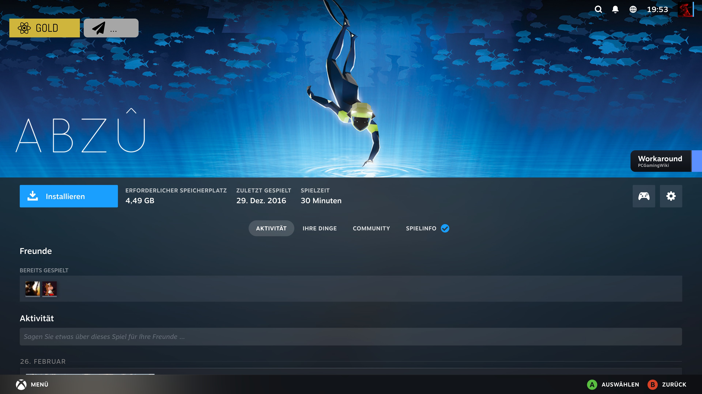</td>
<td width="50%"><strong>No data</strong> 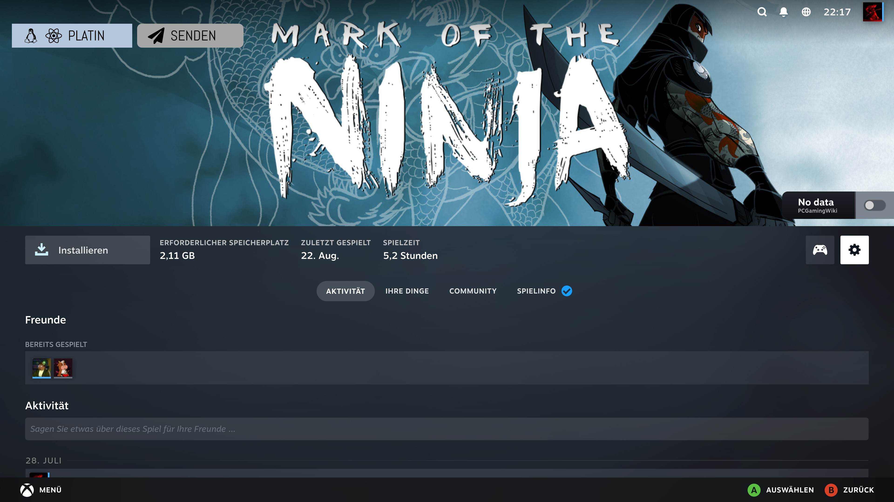</td>
</tr>
</table>

The detail badge also shows the source that supplied the compatibility information.

---

## Automatic HDR switching

Game launches use compatibility information that is already available in the local cache.

<pre>
Steam game launch
        ↓
Read cached HDR result
        ↓
Apply per-game Override
        ↓
Remember previous HDR state
        ↓
Set global HDR state
        ↓
Launch game
        ↓
Game exits
        ↓
Restore previous HDR state
</pre>

**The launch path never waits for a live network request.**

If no reliable compatibility result is available, HDR Auto Pilot defaults to SDR.

---

## Per-game Override

Installed games expose an **Override** switch next to the HDR badge.

Override reverses HDR Auto Pilot's normal launch decision for that game.

| Auto Pilot would | Override does |
| --- | --- |
| Enable HDR | Launch in SDR |
| Disable HDR | Launch with HDR enabled |

The displayed HDR badge continues to represent the detected compatibility data. Override changes launch behavior only.

  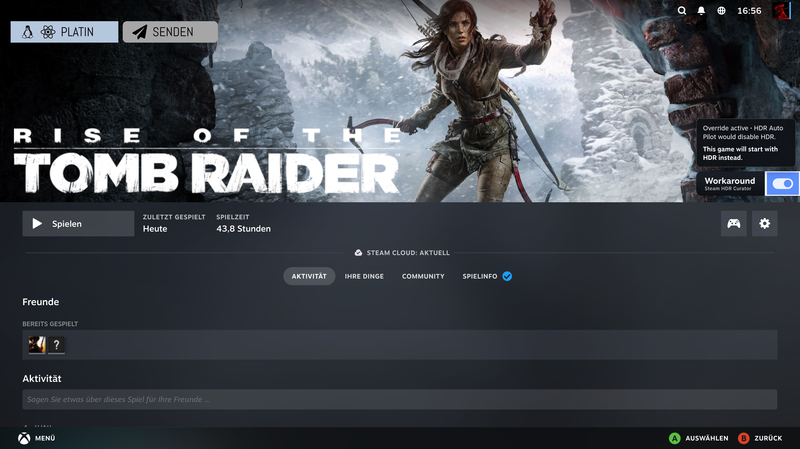

Override is useful for cases such as:

- HDR mods
- RenoDX profiles
- community HDR patches
- injectors
- incomplete compatibility metadata
- manually configured HDR workarounds

For **Workaround** results, HDR remains disabled by default because HDR Auto Pilot cannot know whether the required modification is actually installed.

---

## Data sources and caching

Network lookups are deliberately separated from game launching.

### PCGamingWiki

[PCGamingWiki](https://www.pcgamingwiki.com/) is the primary HDR compatibility source.

HDR Auto Pilot resolves Steam AppIDs to matching PCGamingWiki pages and normalizes the available HDR information into the plugin's user-facing states.

If PCGamingWiki's direct AppID redirect fails, HDR Auto Pilot can fall back to Steam game metadata and PCGamingWiki's MediaWiki search API.

Fallback title matches are validated against the exact Steam AppID before being accepted.

### Steam HDR Curator

[Steam HDR Curator](https://store.steampowered.com/curator/33286359/) is used as an additional source when PCGamingWiki reports:

- No HDR
- No data
- Workaround

Curator information can promote a result to native HDR support or a known HDR workaround.

A result already identified as native HDR by PCGamingWiki is never downgraded.

**Windows Auto HDR entries are intentionally not treated as native HDR support.**

### Local cache and library preload

Compatibility results are stored locally to avoid unnecessary repeated requests.

HDR Auto Pilot preloads HDR compatibility information for the Steam game library in the background so library badges and launch decisions can use cached data immediately.

Steam Game Mode shows a short notification when a full-library HDR data load starts and another when it finishes.

Steam HDR Curator information is stored in a separate persistent cache and refreshed periodically.

### Manual refresh

HDR compatibility data can be refreshed manually through the plugin settings.

---

## Controller navigation

The library integration is designed for Steam Game Mode and controller use.

For installed games:

- **Right** from HDR badge → Override
- **Left** from Override → HDR badge
- **Down** from Override → Steam settings button
- **Up** from Steam settings button → Override

External compatibility pages opened from the badge can be closed with controller **B**.

---

## Plugin settings

HDR Auto Pilot currently provides settings for:

- enabling or disabling automatic HDR switching
- restoring the previous HDR state after game exit
- refreshing cached HDR compatibility data

Per-game Override selections are stored persistently.

<table>
<tr>
<td width="50%"><strong>Main settings</strong> </td>
<td width="50%"><strong>Advanced settings</strong> 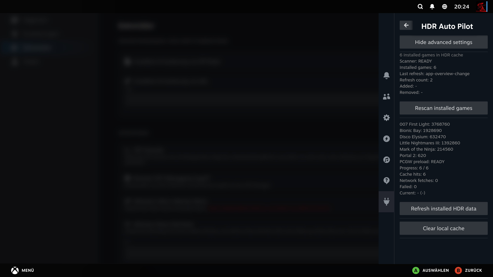</td>
</tr>
</table>

---

## Requirements

- Steam
- Decky Loader
- Steam Game Mode / Gamescope
- HDR-capable display
- Working HDR output in the host system

HDR Auto Pilot controls the HDR state exposed by the Steam / Gamescope environment.

It does **not** convert SDR games into HDR.

---

## Installation

HDR Auto Pilot is currently distributed as a Decky plugin ZIP package.

Official Decky Plugin Store distribution is planned.

### Development build

<pre>
pnpm install
pnpm run build
</pre>

---

## Privacy

HDR Auto Pilot:

- requires no account
- collects no personal information
- contains no analytics
- contains no telemetry

Network access is used only to retrieve HDR compatibility metadata.

---

## Project structure

<pre>
hdr-auto-pilot/
├── assets/
│   ├── icon.png
│   └── screenshots/
├── src/
│   └── index.tsx
├── main.py
├── pcgw_helper.py
├── plugin.json
├── package.json
└── README.md
</pre>

### Frontend

The TypeScript/React frontend handles:

- Steam library badge integration
- mini badges
- Override control
- plugin settings
- controller navigation
- game launch detection
- HDR switching
- previous-state restoration

### Backend

The Python backend handles:

- persistent settings
- PCGamingWiki resolution
- compatibility caching
- Steam HDR Curator caching
- source fallback logic

### PCGamingWiki helper

`pcgw_helper.py` performs isolated PCGamingWiki resolution in a sanitized Python environment.

---

## Design principles

HDR Auto Pilot follows a few deliberate rules:

- Game launches must never depend on a live network request.
- Native HDR and SDR-to-HDR conversion are not treated as the same thing.
- Compatibility metadata and user overrides remain separate.
- Unknown compatibility defaults conservatively to SDR.
- The user can reverse the automated decision for an installed game.

---

## Credits

HDR compatibility information is provided by:

- [PCGamingWiki](https://www.pcgamingwiki.com/)
- [Steam HDR Curator](https://store.steampowered.com/curator/33286359/)

Built for [Decky Loader](https://github.com/SteamDeckHomebrew/decky-loader) using the official Decky plugin template.

---

## License

See [LICENSE](LICENSE).
